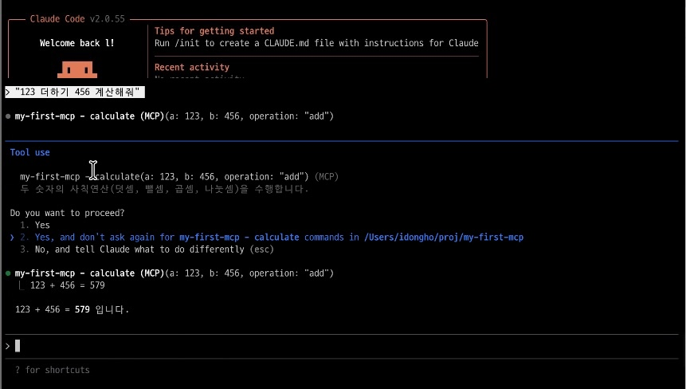
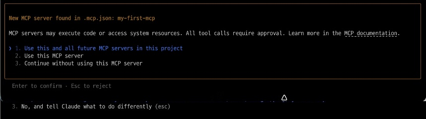
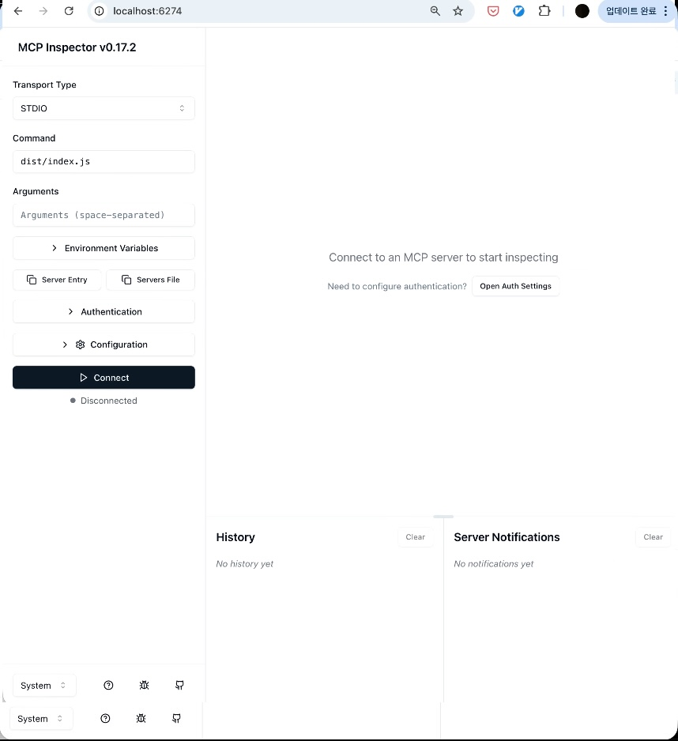
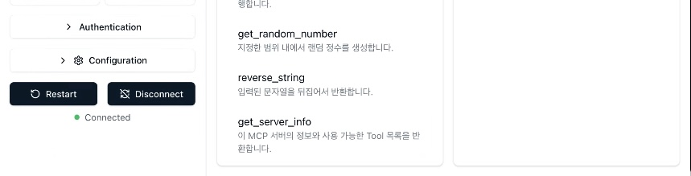

# my-first-mcp

MCP(Model Context Protocol) 서버 개발 튜토리얼 - 첫 번째 MCP 서버

[](https://opensource.org/licenses/MIT)
[](https://nodejs.org/)
[](https://www.typescriptlang.org/)

## 소개

이 프로젝트는 MCP(Model Context Protocol) 서버 개발을 배우기 위한 튜토리얼입니다. Claude Code와 같은 AI 도구에서 사용할 수 있는 간단한 MCP 서버를 구현합니다.

### 제공 Tool

| Tool | 설명 | 사용 예시 |
|------|------|----------|
| `get_current_time` | 현재 시간 조회 | "지금 몇 시야?" |
| `calculate` | 사칙연산 계산기 | "123 + 456 계산해줘" |
| `get_random_number` | 랜덤 숫자 생성 | "로또 번호 뽑아줘" |
| `reverse_string` | 문자열 뒤집기 | "hello 뒤집어줘" |
| `get_server_info` | 서버 정보 조회 | "MCP 서버 정보" |
| `analyze_structure` | 프로젝트 구조 분석 | "프로젝트 구조 보여줘" |
| `analyze_dependencies` | 의존성 분석 | "package.json 분석해줘" |
| `count_lines` | 코드 라인 수 통계 | "코드 라인 수 알려줘" |
| `server_status` | 서버 상태 조회 | "서버 상태 확인해줘" |

## 스크린샷

### Claude Code에서 Tool 실행

> "123 더하기 456 계산해줘" → calculate Tool 실행 → "123 + 456 = 579 입니다"

### MCP 서버 자동 감지

> `.mcp.json` 파일로 프로젝트 진입 시 자동 감지

### MCP Inspector UI

> MCP Inspector로 서버 테스트 및 디버깅

### MCP Inspector Tool 목록

> 5개 Tool (get_current_time, calculate, get_random_number, reverse_string, get_server_info)

## 설치

### 요구사항

- Node.js 20+
- npm 또는 pnpm

### 설치 방법

```bash
# 저장소 클론
git clone https://github.com/dh1789/my-first-mcp.git
cd my-first-mcp

# 의존성 설치
npm install

# 빌드
npm run build
```

## 사용법

### Claude Code에 연결

```bash
# MCP 서버 등록
claude mcp add my-first-mcp -- node /path/to/my-first-mcp/dist/index.js

# 연결 확인
claude mcp list
```

### MCP Inspector로 테스트

```bash
npm run inspect
# 브라우저에서 http://localhost:6274 접속
```

### 직접 실행

```bash
npm start
```

## 개발

### 프로젝트 구조

```
my-first-mcp/
├── src/
│   ├── index.ts              # MCP 서버 진입점
│   ├── tools.ts              # Day 1: 기본 Tool 로직
│   ├── resources.ts          # Day 2: Resource 로직
│   ├── prompts.ts            # Day 2: Prompt 로직
│   ├── project-analyzer.ts   # Day 3: 프로젝트 분석기
│   ├── advanced.ts           # Day 5: 고급 패턴 (캐싱, 보안, 로깅)
│   └── *.test.ts             # 유닛 테스트
├── dist/                     # 빌드 결과물
├── package.json
├── tsconfig.json
└── vitest.config.ts
```

### 스크립트

```bash
npm run build     # TypeScript 빌드
npm test          # 유닛 테스트 실행 (31 tests)
npm run test:watch # 테스트 watch 모드
npm run inspect   # MCP Inspector 실행
npm start         # 서버 실행
```

### 테스트

TDD 방식으로 120개 유닛 테스트가 포함되어 있습니다:

```bash
npm test

# 결과
# ✓ src/tools.test.ts (31 tests)
# ✓ src/resources.test.ts (11 tests)
# ✓ src/prompts.test.ts (13 tests)
# ✓ src/project-analyzer.test.ts (18 tests)
# ✓ src/advanced.test.ts (30 tests)
# ✓ src/package-config.test.ts (14 tests)
# ✓ src/shebang.test.ts (3 tests)
# Test Files  7 passed (7)
# Tests       120 passed (120)
```

## 기술 스택

- **Runtime**: Node.js 20+
- **Language**: TypeScript 5.7
- **MCP SDK**: @modelcontextprotocol/sdk
- **Validation**: zod
- **Testing**: vitest

## 관련 문서

- [MCP 공식 스펙](https://modelcontextprotocol.io/specification)
- [TypeScript SDK](https://github.com/modelcontextprotocol/typescript-sdk)
- [MCP Inspector](https://www.npmjs.com/package/@modelcontextprotocol/inspector)

## 라이선스

MIT License - 자유롭게 사용, 수정, 배포할 수 있습니다.

## 기여

이슈와 PR을 환영합니다!

1. Fork
2. Feature branch 생성 (`git checkout -b feature/amazing-feature`)
3. Commit (`git commit -m 'Add amazing feature'`)
4. Push (`git push origin feature/amazing-feature`)
5. Pull Request 생성

## 작성자

- **idongho** - [GitHub](https://github.com/dh1789)
